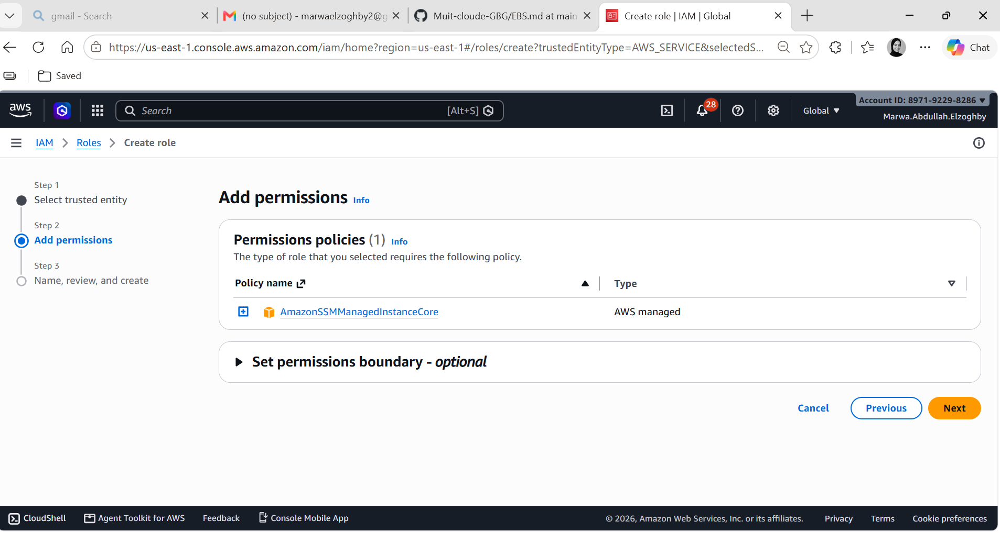
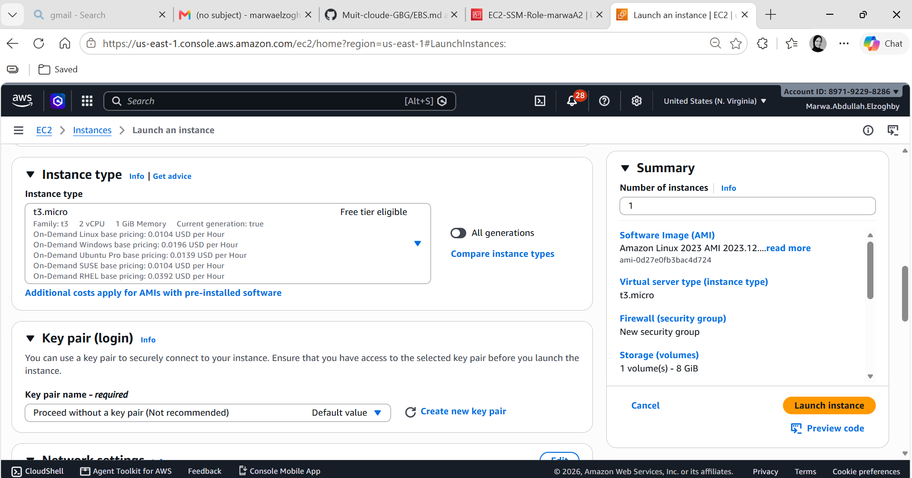
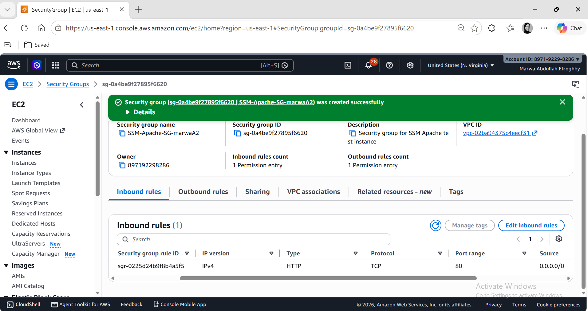
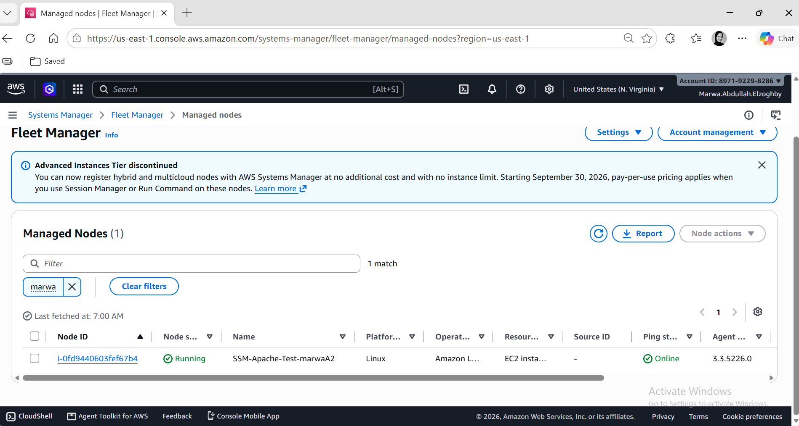
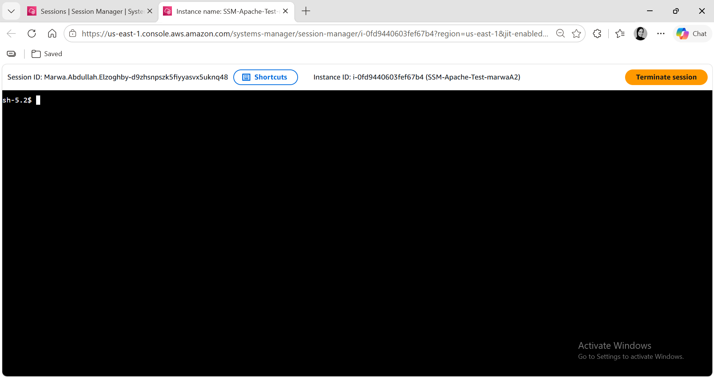
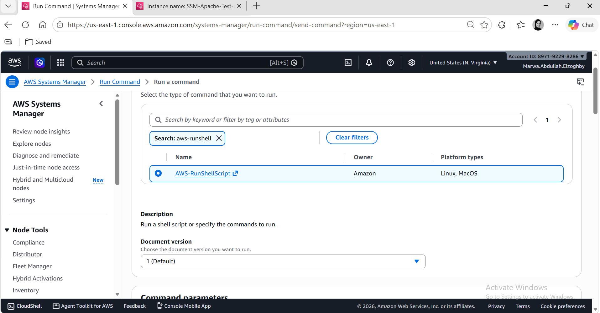
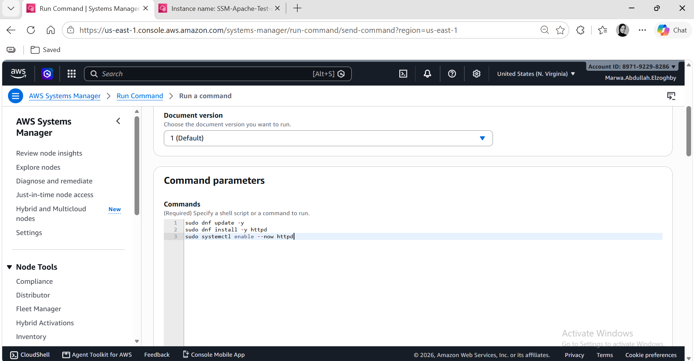
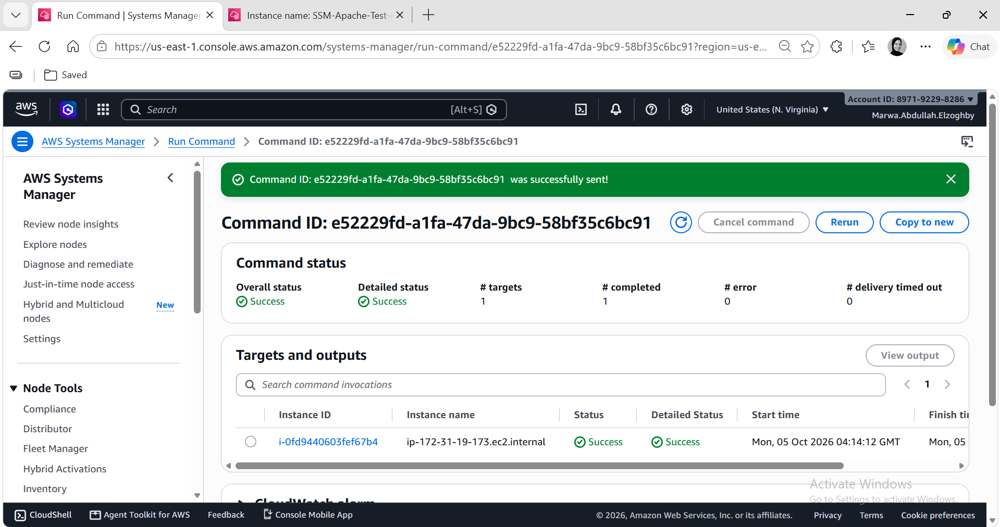
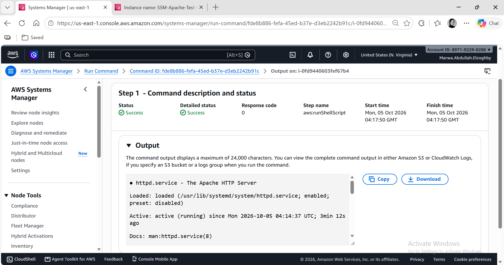
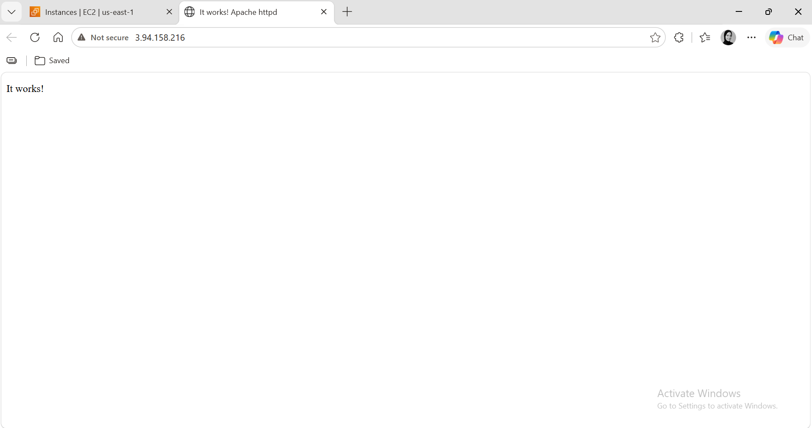

# 🔐 Task 2 --- Part 2: Secure EC2 Management Using AWS Systems Manager

## 📌 Overview

This task demonstrates how to securely manage an Amazon EC2 instance
using **AWS Systems Manager (SSM)** without relying on SSH access or
manually managed SSH key pairs.

The implementation uses:

-   **AWS IAM** for permissions
-   **Amazon EC2** running Amazon Linux 2023
-   **AWS Systems Manager Session Manager** for interactive remote
    access
-   **AWS Systems Manager Run Command** for remote administration
-   **Apache HTTP Server** as the test application
-   **Security Group** allowing HTTP traffic on port 80 only

### 🎯 Objectives

By completing this task, the EC2 instance can be:

-   Managed without SSH.
-   Accessed through Session Manager directly from the AWS Console.
-   Configured remotely using Run Command.
-   Used without creating or storing an SSH key pair.
-   Exposed to the internet only through HTTP port 80 for the web-server
    test.

------------------------------------------------------------------------

## 🏗️ Architecture

``` text
                         AWS Cloud
┌─────────────────────────────────────────────────────────┐
│                                                         │
│  IAM Role                                               │
│  EC2-SSM-Role                                           │
│  └── AmazonSSMManagedInstanceCore                       │
│                         │                               │
│                         ▼                               │
│              ┌─────────────────────┐                   │
│              │       EC2           │                   │
│              │ Amazon Linux 2023   │                   │
│              │                     │                   │
│              │ SSM Agent           │                   │
│              │ Apache httpd        │                   │
│              └─────────┬───────────┘                   │
│                        │                               │
│              ┌─────────┴─────────┐                     │
│              │                   │                     │
│              ▼                   ▼                     │
│       Session Manager       Run Command                │
│       Interactive shell     Remote commands            │
│                                                         │
└────────────────────────────┬────────────────────────────┘
                             │
                             │ HTTP :80
                             ▼
                         Web Browser
```

------------------------------------------------------------------------

# 1. 🔑 Create the IAM Role

An IAM role was created for the EC2 instance to allow it to communicate
with AWS Systems Manager.

### Role configuration

**Role name:**

``` text
EC2-SSM-Role
```

**Trusted service:**

``` text
EC2
```

**Permission policy:**

``` text
AmazonSSMManagedInstanceCore
```

The `AmazonSSMManagedInstanceCore` AWS-managed policy provides the
permissions required for Systems Manager to manage the EC2 instance.

The role was created using the AWS Console option:

> **EC2 Role for AWS Systems Manager**

### 📸 

> 🖼️ **Screenshot placeholder --- IAM role and attached Systems Manager
> permissions**

------------------------------------------------------------------------

# 2. 🖥️ Launch the EC2 Instance

An EC2 instance was launched using **Amazon Linux 2023**.

### Instance configuration

  Setting         Configuration
  --------------- --------------------------------
  Name            `SSM-Apache-Test`
  AMI             Amazon Linux 2023
  Instance Type   `t3.micro`
  Key Pair        **Proceed without a key pair**
  IAM Role        `EC2-SSM-Role`
  Subnet          Public subnet
  Public IPv4     Enabled

### 🔐 SSH Key Pair

No SSH key pair was created or attached to the instance.

This is intentional because the instance will be accessed through
**Systems Manager Session Manager** instead of SSH.

Therefore, there is no requirement to:

-   Create an `.pem` file
-   Store an SSH private key
-   Configure SSH access
-   Open TCP port 22

### 📸 

> 🖼️ **Screenshot placeholder --- EC2 instance configuration showing
> Amazon Linux 2023 and no key pair**

------------------------------------------------------------------------

# 3. 🌐 Configure the Security Group

A security group was configured for the web server.

### Inbound rule

  Protocol     Port Source        Purpose
  ---------- ------ ------------- ------------------------------
  HTTP           80 `0.0.0.0/0`   Access Apache from a browser

### SSH Security

No inbound SSH rule was configured.

``` text
TCP 22 → NOT ALLOWED
```

This demonstrates that remote administration does not require opening
port 22.

The only inbound traffic required for the final web-server test is:

``` text
TCP 80 → HTTP
```

### 📸 

> 🖼️ **Screenshot placeholder --- Security Group showing HTTP port 80
> and no SSH rule**

------------------------------------------------------------------------

# 4. 📡 Verify Systems Manager Connectivity

After launching the instance, it was allowed a few minutes to register
with AWS Systems Manager.

The instance was then checked under:

**AWS Systems Manager → Managed Nodes**

The EC2 instance appeared as an available managed node with an
online/connected status.

This confirms that:

``` text
EC2
 ↓
SSM Agent
 ↓
AWS Systems Manager
```

is functioning correctly.

### 📸 

> 🖼️ **Screenshot placeholder --- Systems Manager managed node showing
> the EC2 instance as Online**

------------------------------------------------------------------------

# 5. 🧑‍💻 Access the Instance Using Session Manager

AWS Systems Manager **Session Manager** was used to establish an
interactive shell session.

Navigation:

``` text
AWS Systems Manager
→ Session Manager
→ Start session
→ Select EC2 instance
→ Start session
```

A shell was opened directly from the AWS Management Console.

No SSH client or private key was required.

### 🔎 Verify the Instance

Inside the Session Manager shell, the following commands can be used to
verify the operating system and current user:

``` bash
hostname
```

``` bash
whoami
```

``` bash
cat /etc/os-release
```

``` bash
uname -a
```

The output confirms that the shell is running on the Amazon Linux 2023
EC2 instance.

### 📸 

> 🖼️ **Screenshot placeholder --- Successful Session Manager shell
> session**

------------------------------------------------------------------------

# 6. ⚙️ Install Apache Using Run Command

AWS Systems Manager **Run Command** was used to install and configure
Apache without manually logging into the server.

Navigation:

``` text
AWS Systems Manager
→ Run Command
→ Run command
```

The command document used was:

``` text
AWS-RunShellScript
```

The EC2 instance was selected as the target.

### Commands executed

``` bash
sudo dnf update -y
sudo dnf install -y httpd
sudo systemctl enable --now httpd
```

### Explanation

#### Update packages

``` bash
sudo dnf update -y
```

Updates installed packages on the Amazon Linux instance.

#### Install Apache

``` bash
sudo dnf install -y httpd
```

Installs the Apache HTTP Server package.

#### Enable and start Apache

``` bash
sudo systemctl enable --now httpd
```

This:

-   Starts Apache immediately.
-   Enables Apache to start automatically after a reboot.

### 📸 
### 📸 

> 🖼️ **Screenshot placeholder --- Run Command configuration showing
> AWS-RunShellScript and the Apache installation commands**

------------------------------------------------------------------------

# 7. ✅ Verify Run Command Execution

The Run Command execution result was checked after submission.

The target EC2 instance returned a successful execution status.

This confirms that Systems Manager successfully delivered and executed
the commands on the instance.

### 📸

> 🖼️ **Screenshot placeholder --- Run Command execution showing
> Success**

------------------------------------------------------------------------

# 8. 🔍 Verify Apache Service

The Apache service was verified using Run Command.

Command:

``` bash
systemctl status httpd --no-pager
```

The expected result is:

``` text
Active: active (running)
```

Apache can also be tested locally from the instance:

``` bash
curl http://localhost
```

The command should return HTML generated by the Apache web server.

### 📸

> 🖼️ **Screenshot placeholder --- Apache service showing active
> (running)**

------------------------------------------------------------------------

# 9. 🌍 Verify Apache From the Browser

The EC2 instance's **Public IPv4 address** was obtained from the EC2
console.

The address was opened in a web browser using:

``` text
http://<PUBLIC-IP>
```

The Apache welcome/test page was displayed successfully.

This confirms that:

``` text
Browser
   │
   │ HTTP :80
   ▼
EC2 Security Group
   │
   ▼
Apache httpd
```

is working correctly.

### 📸  

> 🖼️ **Screenshot placeholder --- Apache welcome page opened using the
> EC2 public IP**

------------------------------------------------------------------------

# 🔐 Security Considerations

This implementation improves the security and operational model compared
with traditional SSH-based administration.

### SSH is not required

The instance does not require:

``` text
SSH port 22
```

and no SSH private key was created.

### Session Manager

Session Manager provides console-based access without exposing SSH to
the internet.

### IAM-based access

Access to Systems Manager is controlled through AWS IAM permissions
instead of distributing SSH private keys.

### Run Command

Administrative commands can be executed centrally through Systems
Manager without opening an interactive SSH connection.

### HTTP remains intentionally open

Port 80 is open because the task requires the Apache web server to be
reachable from a browser.

In a production environment, the source CIDR and overall network
architecture should be restricted according to the application's
requirements.

------------------------------------------------------------------------

# 🧠 Key Concepts Demonstrated

  -----------------------------------------------------------------------
  Concept                             Purpose
  ----------------------------------- -----------------------------------
  IAM Role                            Grants the EC2 instance permissions
                                      required by Systems Manager

  `AmazonSSMManagedInstanceCore`      AWS-managed policy required for
                                      core SSM functionality

  Systems Manager                     Central service for managing AWS
                                      resources

  Session Manager                     Provides interactive shell access
                                      without SSH

  Run Command                         Executes administrative commands
                                      remotely

  SSM Agent                           Connects the EC2 instance to
                                      Systems Manager

  Security Group                      Controls network traffic to the
                                      instance

  Port 80                             Allows HTTP access to Apache

  Port 22                             Not required for this solution

  Apache/httpd                        Web server used to verify the
                                      deployment
  -----------------------------------------------------------------------

------------------------------------------------------------------------

# 🎯 Final Result

The task was completed successfully.

The EC2 instance was:

-   ✅ Launched using Amazon Linux 2023
-   ✅ Configured without an SSH key pair
-   ✅ Assigned an IAM role for Systems Manager
-   ✅ Registered with AWS Systems Manager
-   ✅ Accessed through Session Manager
-   ✅ Managed using Run Command
-   ✅ Configured with Apache HTTP Server
-   ✅ Accessible through HTTP on port 80
-   ✅ Verified through a web browser
-   ✅ Managed without SSH or port 22

------------------------------------------------------------------------

# 🧹 Cleanup

After completing the screenshots and documentation, temporary resources
should be removed if they are no longer needed.

Recommended cleanup:

1.  Terminate the test EC2 instance.
2.  Delete the test security group if it is not used by another
    resource.
3.  Delete the IAM role `EC2-SSM-Role` if it was created exclusively for
    this lab.

⚠️ **Before deleting anything, make sure the resources are not being
used by another task or project.**

------------------------------------------------------------------------


------------------------------------------------------------------------

## 🏁 Conclusion

AWS Systems Manager provides a secure alternative to traditional
SSH-based EC2 administration.

Using **Session Manager** and **Run Command**, the instance can be
accessed and configured through AWS without distributing SSH keys or
exposing port 22. This approach centralizes access through IAM and is
particularly useful for improving operational security and simplifying
instance management.
