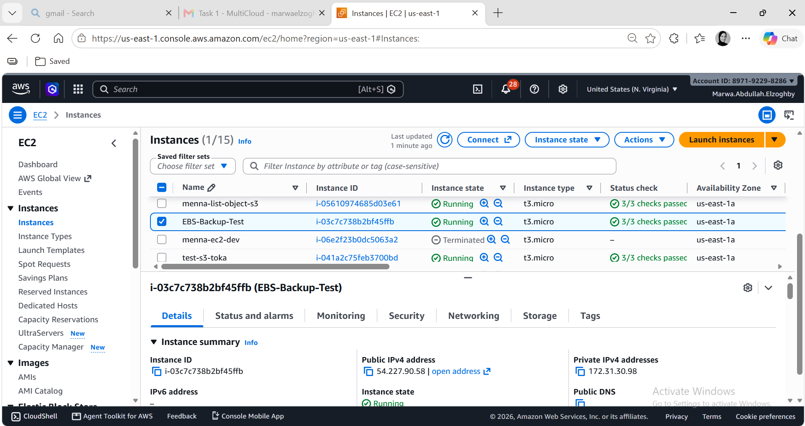
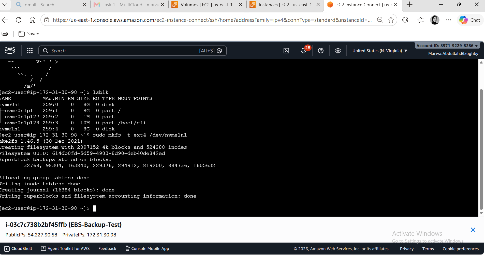
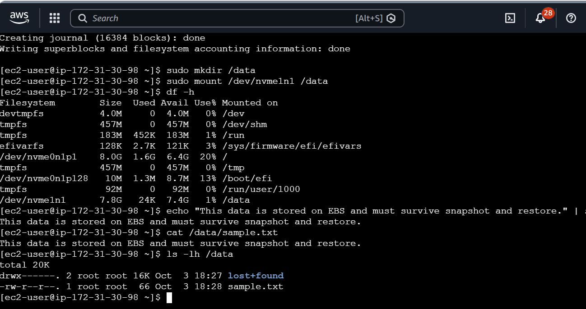
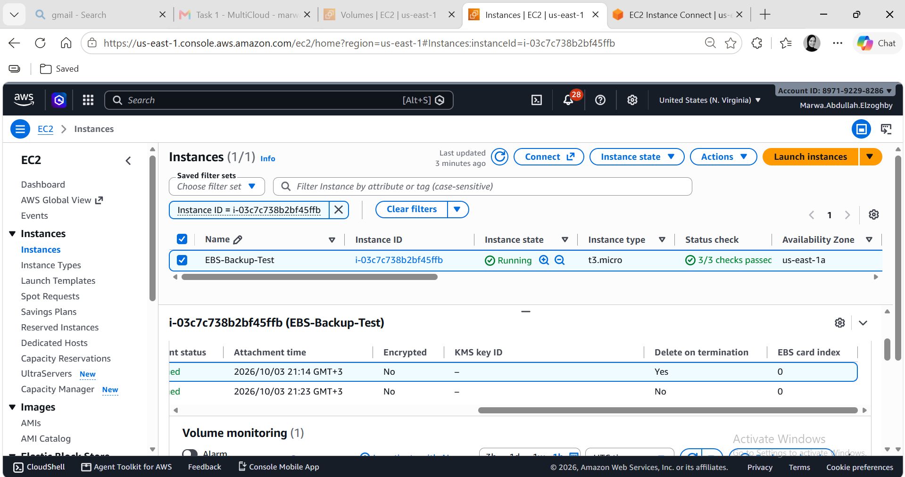
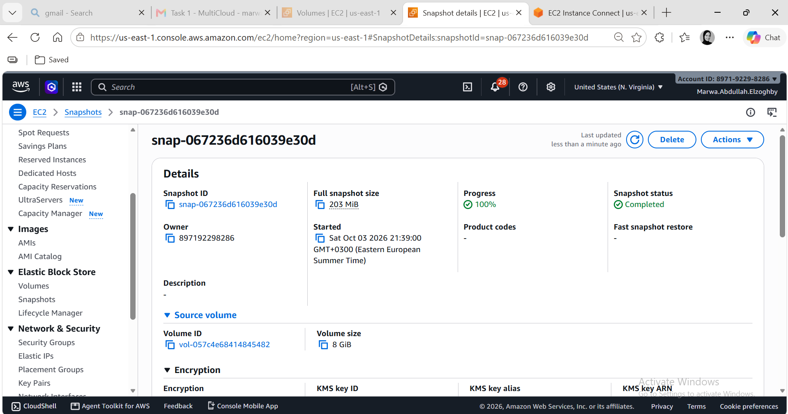
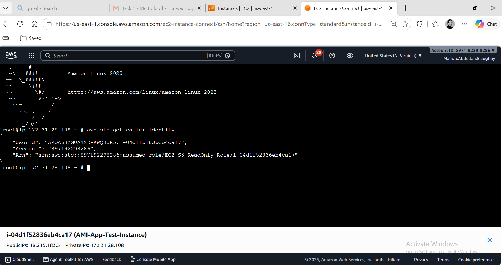

# AWS Technical Lab Documentation: EBS Management, Snapshot Lifecycle & IAM Role Assignment

## Overview
This document serves as step-by-step technical documentation for provisioning an AWS EC2 instance, managing additional EBS volumes, creating and restoring EBS snapshots, setting up IAM roles for S3 access, and cleaning up AWS resources.

---

## Technical Information & Parameters Summary

* **Region / Availability Zone:** `us-east-1` / `us-east-1a` (`use1-az4`)
* **Instance Name:** `EBS-Backup-Test`
* **Instance ID:** `i-03c7c738b2bf45ffb`
* **Instance Type:** `t3.micro`
* **AMI:** Amazon Linux 2023
* **Public IPv4:** `54.227.90.58`
* **Private IPv4:** `172.31.30.98`
* **VPC ID:** `vpc-02ba94375c4eecf31`
* **Subnet ID:** `subnet-0f5428c13342fc6d8`
* **Original Volume ID:** `vol-057c4e68414845482` (8 GiB, `gp3`)
* **Snapshot ID:** `snap-067236d616039e30d`

---

## Step 1: Provisioning the Standalone EC2 Instance

1. Navigate to **EC2 Console** $\rightarrow$ **Instances** $\rightarrow$ **Launch Instance**.
2. **Name:** `EBS-Backup-Test`
3. **AMI:** `Amazon Linux 2023`
4. **Instance Type:** `t3.micro`
5. **Storage:** Standard Root Volume (`8 GiB gp3`). *Additional volume was attached subsequently.*
6. **Network:** Selected the designated VPC and Subnet enforcing `us-east-1a` availability zone consistency.
7. Launch the instance and wait for `Instance State: Running`.

> 📷 ****
> *Description:* Capture the EC2 instance details panel showing **Instance ID (`i-03c7c738b2bf45ffb`)**, **Instance State (`Running`)**, **Public/Private IPv4 Addresses**, and **Availability Zone (`us-east-1a`)**.

---

## Step 2: EBS Volume Formatting and Mounting

### 2.1 Verify Disk Devices
Connect to the instance via **EC2 Instance Connect** or SSH and list available block devices:
```bash
lsblk
```
*Output Verification:*
```text
NAME          MAJ:MIN RM SIZE RO TYPE MOUNTPOINTS
nvme0n1       259:0    0   8G  0 disk 
├─nvme0n1p1   259:1    0   8G  0 part /
├─nvme0n1p127 259:2    0   1M  0 part 
└─nvme0n1p128 259:3    0  10M  0 part /boot/efi
nvme1n1       259:4    0   8G  0 disk 
```

### 2.2 Format and Mount the Secondary Volume
1. Format `/dev/nvme1n1` using the `ext4` filesystem:
```bash
sudo mkfs -t ext4 /dev/nvme1n1
```
2. Create a mount point directory:
```bash
sudo mkdir /data
```
3. Mount the target volume to `/data`:
```bash
sudo mount /dev/nvme1n1 /data
```
4. Confirm mount operation using filesystem disk usage command:
```bash
df -h
```
*Expected result:* `/dev/nvme1n1` is mounted at `/data` with available space.

> 📷 ****
> *Description:* Terminal screenshot displaying the output of `df -h` showing `/dev/nvme1n1` successfully mounted on `/data`.

---

## Step 3: Sample Data Creation & Persistence Setting

### 3.1 Writing Data to the EBS Volume
Create sample data on the mounted EBS volume to verify persistence post-snapshot and restore operations:
```bash
echo "This data is stored on EBS and must survive snapshot and restore." | sudo tee /data/sample.txt
cat /data/sample.txt
ls -lh /data
```

> 📷 ****
> *Description:* Terminal output showing creation and confirmation of `sample.txt` inside `/data`.

### 3.2 Configure Volume Termination Settings
Ensure that the secondary EBS volume persists upon EC2 termination:
1. Navigate to **EC2** $\rightarrow$ **Instances** $\rightarrow$ **Storage Tab**.
2. Modify the volume properties for `/dev/sdf` (`vol-057c4e68414845482`).
3. Set **Delete on Termination** to `No`.

> 📷 ****
> *Description:* AWS Console screenshot showing the Storage tab for instance `i-03c7c738b2bf45ffb` with `Delete on Termination: No` configured for the non-root volume.

---

## Step 4: Creating and Restoring EBS Snapshot

### 4.1 Create EBS Snapshot
1. Open **EC2 Console** $\rightarrow$ **Elastic Block Store** $\rightarrow$ **Volumes**.
2. Select `vol-057c4e68414845482`.
3. Select **Actions** $\rightarrow$ **Create Snapshot**.
4. Assigned Snapshot ID: `snap-067236d616039e30d`.
5. Wait for status to transition to `Completed`.

> 📷 ****
> *Description:* AWS Console showing `snap-067236d616039e30d` in `Completed` state under the Snapshots dashboard.

### 4.2 Restore Volume from Snapshot
1. Select `snap-067236d616039e30d` $\rightarrow$ **Actions** $\rightarrow$ **Create Volume from Snapshot**.
2. Set configuration:
   * **Volume Type:** `gp3`
   * **Size:** `8 GiB`
   * **Availability Zone:** `us-east-1a` *(Must match EC2 instance AZ)*
3. Attach the newly restored volume to instance `i-03c7c738b2bf45ffb` as `/dev/sdg`.


---

## Step 5: IAM Role Configuration and EC2 Verification

### 5.1 Role Inspection and Assignment
1. Open **IAM Console** $\rightarrow$ **Roles** $\rightarrow$ Select `EC2-S3-ReadOnly-Role`.
2. Verify policy permissions (`AmazonS3ReadOnlyAccess` allowing `s3:GetObject` and `s3:ListBucket`).
3. Verify **Trust Relationships** to ensure trust principal is `ec2.amazonaws.com`.
4. Attach role to instance:
   * **EC2 Console** $\rightarrow$ **Instances** $\rightarrow$ Select `EBS-Backup-Test`.
   * **Actions** $\rightarrow$ **Security** $\rightarrow$ **Modify IAM role**.
   * Select `EC2-S3-ReadOnly-Role` $\rightarrow$ **Update IAM role**.


### 5.2 Validate S3 Access via AWS CLI
Connect via SSH / Instance Connect to the instance and execute caller identity validation:
```bash
aws sts get-caller-identity
```

> 📷 ****
> *Description:* Terminal window showing response of `aws sts get-caller-identity` displaying the assumed `EC2-S3-ReadOnly-Role` identity ARN.

---

## Step 6: Resource Teardown and Cleanup Procedures

To avoid unnecessary operational costs, perform teardown in the following strict order:

1. **Terminate EC2 Instance:**
   * Navigate to **EC2** $\rightarrow$ **Instances**.
   * Select `i-03c7c738b2bf45ffb` $\rightarrow$ **Instance State** $\rightarrow$ **Terminate Instance**.
   * *Note: Root volume is deleted automatically.*
2. **Delete Restored EBS Volume:**
   * **EC2** $\rightarrow$ **Volumes** $\rightarrow$ Select restored volume (State: `Available`) $\rightarrow$ **Actions** $\rightarrow$ **Delete Volume**.
3. **Delete Original Secondary EBS Volume:**
   * Select `vol-057c4e68414845482` (State: `Available`) $\rightarrow$ **Actions** $\rightarrow$ **Delete Volume**.
4. **Delete Snapshot:**
   * **EC2** $\rightarrow$ **Snapshots** $\rightarrow$ Select `snap-067236d616039e30d` $\rightarrow$ **Actions** $\rightarrow$ **Delete Snapshot**.


