# Task 1: Secure and Scalable Web Application on AWS

**Student:** Marwa Abdullah Elzoghby
**Region:** US East (N. Virginia), `us-east-1`
**Date:** _[fill in]_

> **How to use this file:** Save your screenshots in a folder named `screenshots/` next to this file, named exactly as the IDs below (for example `P2-3.png`). The images will then appear in any Markdown viewer. Lines marked 📸 tell you what each screenshot must show. Delete them when you finish. Hide or blur any secret keys before taking screenshots.
>
> **Items marked `[Completed / Not performed]`:** choose one. If you did **not** perform it, replace that section's content with the single line "Not performed in this lab session" and delete its screenshot placeholders.

---

## 1. Overview

This lab deploys a web application on AWS with these goals:

- Secure access with IAM (MFA enforcement, read-only access, tag-based DevOps role).
- EC2 access to S3 through an IAM role, with no stored access keys.
- A load-balanced, auto-scaling web tier built from a custom AMI.
- EBS volume, snapshot, and AMI-based recovery.

### Environment summary

| Item | Value |
|---|---|
| Region | us-east-1 (N. Virginia) |
| Account ID | 897192298286 |
| S3 bucket | `lab-app-bucket-897192298286` |
| Sample file | `sample.txt.txt` (the double extension came from Windows hiding file extensions) |
| Standalone instance | `lab-app-server` (Amazon Linux 2023, t3.micro) |
| Custom AMI | `lab-app-ami` |
| Load balancer | `lab-alb` |
| Target group | `lab-tg` |
| Launch template | `lab-launch-template` |
| Auto Scaling Group | `lab-asg` (min 2, desired 2, max 4) |

### Completion status

| Requirement | Status | Notes |
|---|---|---|
| MFA enforcement policy | Blocked | Explicit deny on `iam:CreatePolicy` |
| Read-only group and user | Blocked | Not authorized to attach `ReadOnlyAccess` |
| DevOps role with tag-based EC2 control | _[Not performed]_ | _[Not Authorized]_ |
| EC2 to S3 through IAM role (IMDSv2) | Completed | Pre-provisioned role used |
| Web app on EC2, custom AMI | Completed | |
| ALB, target group, launch template, ASG | Completed | |
 Launch a test instance from the AMI | Not performed | The AMI was used to build the Auto Scaling Group |
| Cleanup | _Completed_ | |

---

## 2. Part 1: Secure IAM Access

The student account has a guardrail policy, `Students-Limited-Access-Policy`, that blocks several IAM actions. Where an action was denied, the error is shown below as evidence, followed by the **intended design** that would have been applied with sufficient permissions.

### 2.1 MFA enforcement policy: Blocked

**Attempted:** IAM → Policies → Create policy → JSON, named `lab-Enforce-MFA`.

**Result:** Failed with an explicit deny:

```
User: arn:aws:iam::897192298286:user/Marwa.Abdullah.Elzoghby is not authorized to
perform: iam:CreatePolicy on resource: policy lab-Enforce-MFA with an explicit deny
in an identity-based policy: arn:aws:iam::897192298286:policy/Students-Limited-Access-Policy
```

An explicit deny always overrides any allow in AWS, so this could not be worked around from the student side.

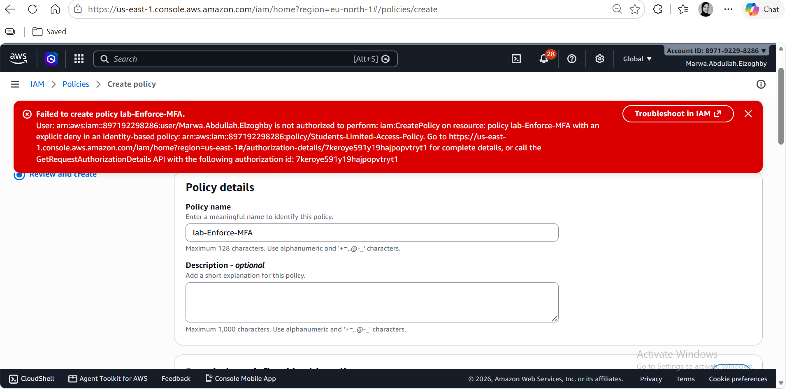
> 📸 **1:** the "Failed to create policy lab-Enforce-MFA" error message.

**Intended design.** The policy allows users to manage their own MFA and password, and denies all other actions when the request is not authenticated with MFA. It would be attached to both lab groups, and kept separate from the EC2 application role:

```json
{
  "Version": "2012-10-17",
  "Statement": [
    {
      "Sid": "AllowSelfServiceMFAandPassword",
      "Effect": "Allow",
      "Action": [
        "iam:GetUser",
        "iam:ChangePassword",
        "iam:GetAccountPasswordPolicy",
        "iam:ListVirtualMFADevices",
        "iam:CreateVirtualMFADevice",
        "iam:EnableMFADevice",
        "iam:ResyncMFADevice",
        "iam:ListMFADevices"
      ],
      "Resource": "*"
    },
    {
      "Sid": "DenyEverythingElseWithoutMFA",
      "Effect": "Deny",
      "NotAction": [
        "iam:GetUser",
        "iam:ChangePassword",
        "iam:GetAccountPasswordPolicy",
        "iam:ListVirtualMFADevices",
        "iam:CreateVirtualMFADevice",
        "iam:EnableMFADevice",
        "iam:ResyncMFADevice",
        "iam:ListMFADevices",
        "sts:GetSessionToken"
      ],
      "Resource": "*",
      "Condition": {
        "BoolIfExists": { "aws:MultiFactorAuthPresent": "false" }
      }
    }
  ]
}
```

**How it works:** `BoolIfExists` makes the deny apply both when MFA is explicitly absent (`false`) and when the key is missing (for example long-term access keys). The `NotAction` list keeps the MFA setup actions available, so a user can still register a device.

### 2.2 Read-only group and user: Blocked

**Attempted:** create `lab-ReadOnly-Group` and attach the AWS-managed `ReadOnlyAccess` policy.

**Result:** The account was not authorized to attach the policy. _[Describe exactly what you saw: the policy missing from the list, or an error message.]_

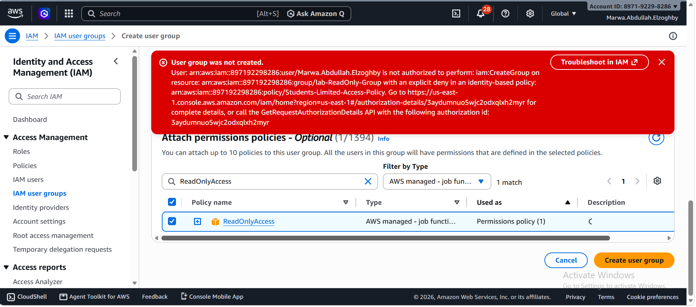
> 📸 **2:** the policy list or error showing `ReadOnlyAccess` could not be attached.

**Intended design:**

- Group `lab-ReadOnly-Group` with the AWS-managed `ReadOnlyAccess` policy.
- User `lab-readonly-user` in the group, with an MFA device and the MFA enforcement policy applied.
- Expected result: listing S3 buckets succeeds; creating or deleting resources is denied.

### 2.3 DevOps role with tag-based EC2 control: _[Not performed]_

_[Couldn't create the devops user, Not Authorized]_


**Intended design.** Permissions policy `lab-DevOps-EC2-Dev-Only`:

```json
{
  "Version": "2012-10-17",
  "Statement": [
    {
      "Sid": "ViewEC2",
      "Effect": "Allow",
      "Action": ["ec2:Describe*"],
      "Resource": "*"
    },
    {
      "Sid": "ManageOnlyDevTaggedInstances",
      "Effect": "Allow",
      "Action": [
        "ec2:StartInstances",
        "ec2:StopInstances",
        "ec2:RebootInstances",
        "ec2:TerminateInstances"
      ],
      "Resource": "arn:aws:ec2:*:*:instance/*",
      "Condition": {
        "StringEquals": { "ec2:ResourceTag/Env": "Dev" }
      }
    }
  ]
}
```

Trust policy for `lab-DevOps-Role` (MFA required to assume the role):

```json
{
  "Version": "2012-10-17",
  "Statement": [
    {
      "Effect": "Allow",
      "Principal": { "AWS": "arn:aws:iam::897192298286:user/lab-devops-user" },
      "Action": "sts:AssumeRole",
      "Condition": {
        "Bool": { "aws:MultiFactorAuthPresent": "true" }
      }
    }
  ]
}
```

**How it works:** Start, stop, reboot, and terminate are allowed only on instances whose `Env` tag equals `Dev`. The role has no `ec2:CreateTags` or `ec2:DeleteTags`, so it cannot change tags to bypass the condition.

---

## 3. Part 2: EC2 Access to S3 Using an IAM Role

### 3.1 Private S3 bucket

Created bucket `lab-app-bucket-897192298286` in us-east-1 with **Block all public access** on, and uploaded the sample file.

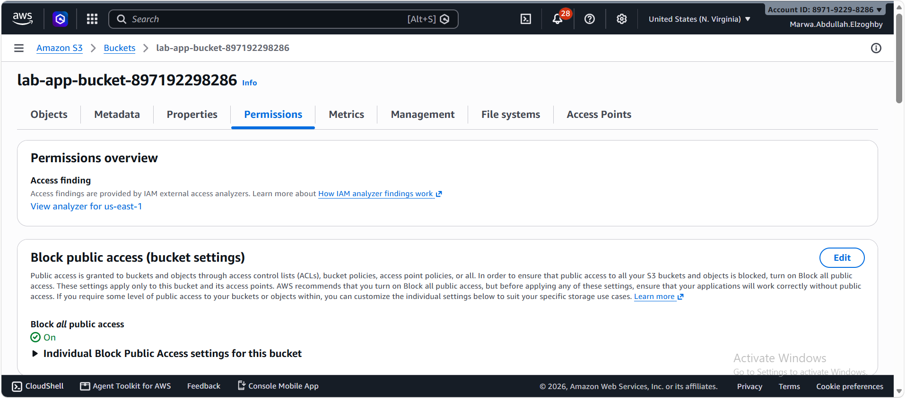
> 📸 **3:** the bucket's **Permissions** tab showing Block all public access = On.

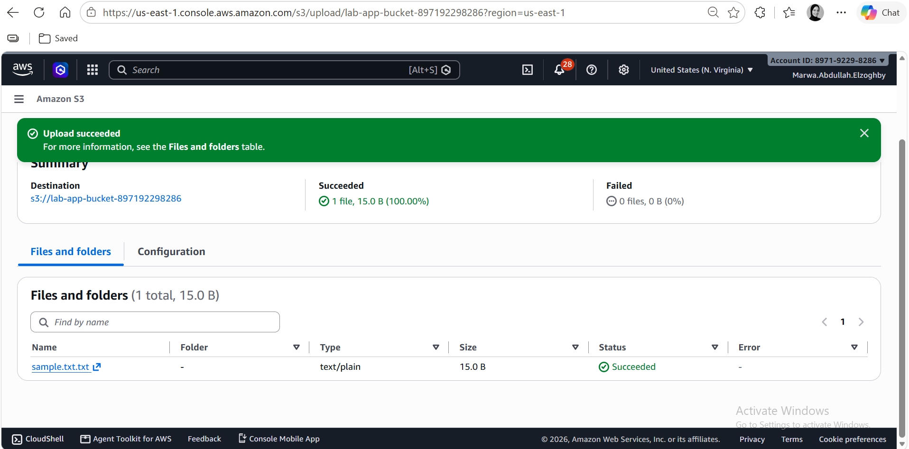
> 📸 **4:** the bucket's **Objects** tab showing the sample file.

### 3.2 IAM role for EC2

A role trusted by the EC2 service was already provisioned in the account, so a pre-made role was used. Its trust policy:

```json
{
  "Version": "2012-10-17",
  "Statement": [
    {
      "Effect": "Allow",
      "Principal": { "Service": "ec2.amazonaws.com" },
      "Action": "sts:AssumeRole"
    }
  ]
}
```

Its permissions come from the AWS-managed policy `AmazonS3ReadOnlyAccess`.

> **Deviation from the lab text:** `AmazonS3ReadOnlyAccess` grants read access to all buckets in the account, not just the lab bucket. The least-privilege version would restrict access to the lab bucket:
>
> ```json
> {
>   "Version": "2012-10-17",
>   "Statement": [
>     { "Effect": "Allow", "Action": "s3:ListAllMyBuckets", "Resource": "*" },
>     { "Effect": "Allow", "Action": "s3:ListBucket",
>       "Resource": "arn:aws:s3:::lab-app-bucket-897192298286" },
>     { "Effect": "Allow", "Action": "s3:GetObject",
>       "Resource": "arn:aws:s3:::lab-app-bucket-897192298286/*" }
>   ]
> }
> ```

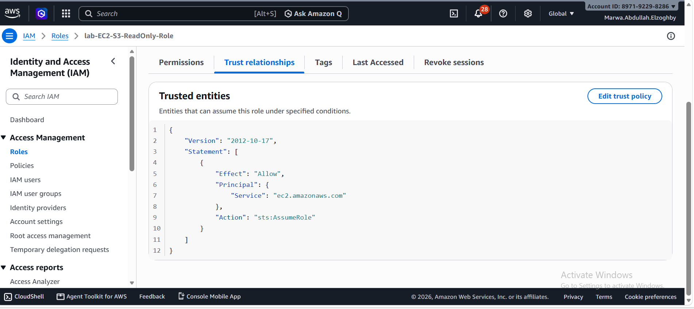
> 📸 **5:** the role's **Trust relationships** tab showing `ec2.amazonaws.com`.

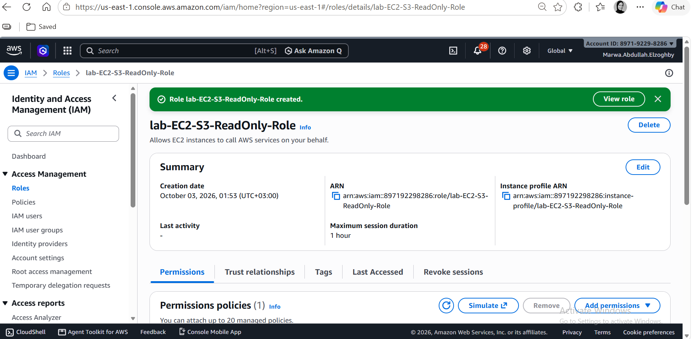
> 📸 **6:** the role's **Permissions** tab showing `AmazonS3ReadOnlyAccess`.

### 3.3 EC2 instance with the role

Launched `lab-app-server` (Amazon Linux 2023, t3.micro) with the role attached through its instance profile. The security group `lab-web-sg` allows SSH and HTTP (80).

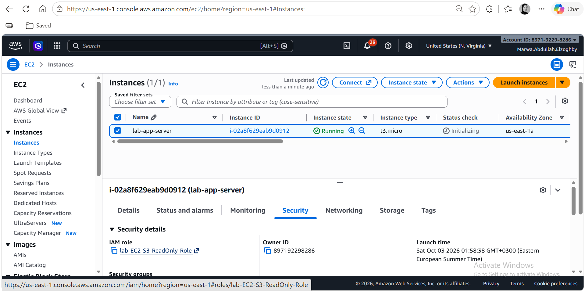
> 📸 **7:** the instance's **Security** tab showing the attached IAM role.


**Connection note:** the first EC2 Instance Connect attempt failed with "Error establishing SSH connection". The cause was the SSH rule being limited to a single IP, while the browser connection comes from the AWS Instance Connect range. Allowing the us-east-1 Instance Connect range fixed it.


### 3.4 S3 access test from the instance

Commands run on the instance:

```bash
ls ~/.aws 2>&1
aws configure list
aws s3 ls
aws s3 ls s3://lab-app-bucket-897192298286
aws s3 cp s3://lab-app-bucket-897192298286/sample.txt.txt . && cat sample.txt.txt
echo test > upload.txt
aws s3 cp upload.txt s3://lab-app-bucket-897192298286/
aws s3 rm s3://lab-app-bucket-897192298286/sample.txt.txt
```

Expected and observed results:

| Test | Expected | Observed |
|---|---|---|
| No stored credentials (`ls ~/.aws`, `aws configure list`) | No keys; source is the IAM role | __ |
| List buckets and bucket contents | Success | Success |
| Download and read the sample file | Success | Success (after using the correct name `sample.txt.txt`) |
| Upload an object | AccessDenied | __ |
| Delete an object | AccessDenied | __ |


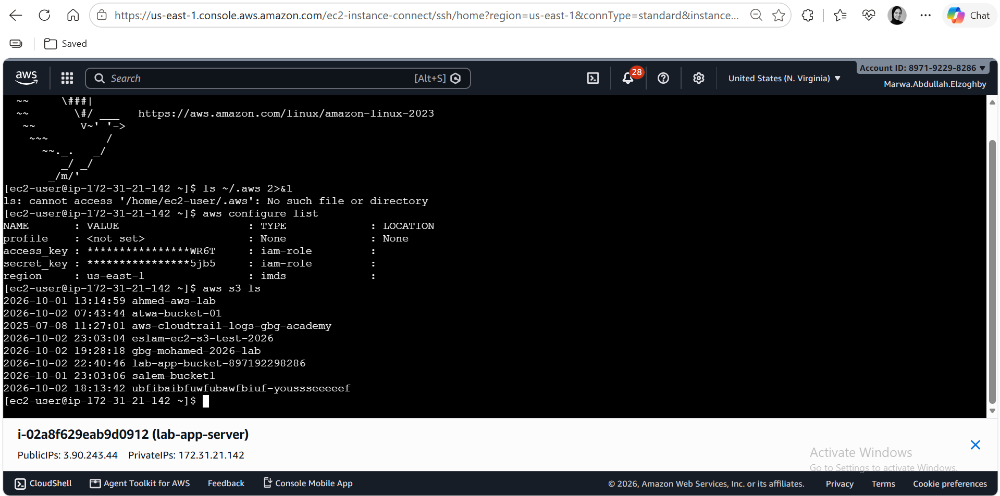
> 📸 **8:** successful bucket listing

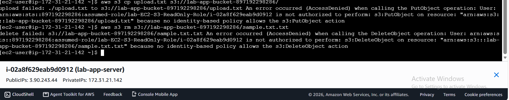
> 📸 **9:** AccessDenied errors for the upload and delete attempts.

### 3.5 Scenario testing: detach and reattach

1. Detached the instance profile (Actions → Security → Modify IAM role → No IAM role).
2. New credentials were no longer available: `aws s3 ls` returned _["Unable to locate credentials"]_.
3. Reattached the role and confirmed S3 access worked again.

**Credential expiry note:** temporary role credentials are valid for several hours, and credentials issued before the detach remain valid until their `Expiration` time. The test therefore shows that **new** credentials are no longer available after detaching. 

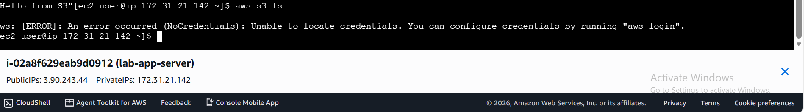
> 📸 **10:** the instance with no IAM role and the failed S3 command.

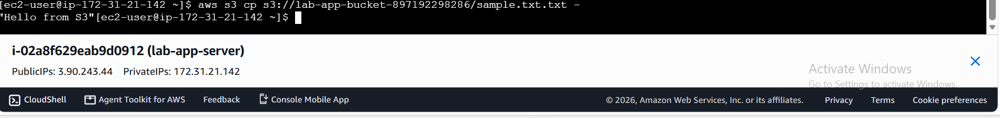
> 📸 **11:** S3 access working again after reattaching the role.

---

## 4. Part 3: Load-Balanced and Scalable Web Application

### 4.1 Application and custom AMI

Installed Apache (`httpd`) on `lab-app-server`. A small systemd service regenerates the page at every boot, so each server created from the AMI shows its own hostname, instance ID, and Availability Zone. The instance reads the sample file from S3 using its role.

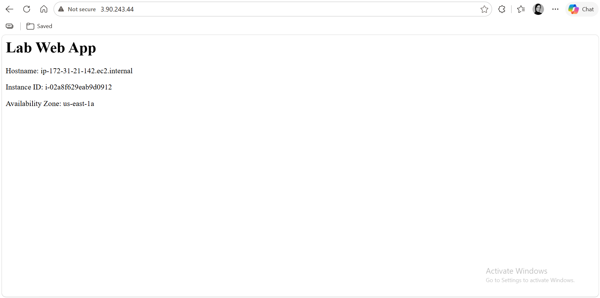
> 📸 **12:** the browser showing the page with the hostname.


> 📸 **13:** the terminal showing the S3 file content read by the instance.

Created the custom AMI `lab-app-ami`.

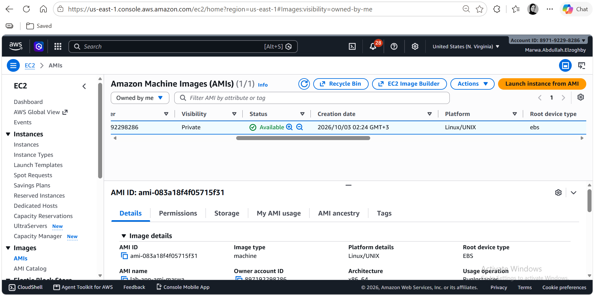
> 📸 **14:** the AMIs page showing `lab-app-ami` as **Available**.

### 4.2 Security groups

- `lab-alb-sg`: allows HTTP (80) from anywhere.
- `lab-web-sg`: allows HTTP (80) only from `lab-alb-sg`, so instances accept web traffic only through the load balancer.

**Note:** AWS does not allow a CIDR rule to be edited into a security-group reference ("You may not specify a referenced group id for an existing IPv4 CIDR rule"). The old HTTP rule was deleted and a new rule referencing `lab-alb-sg` was added.

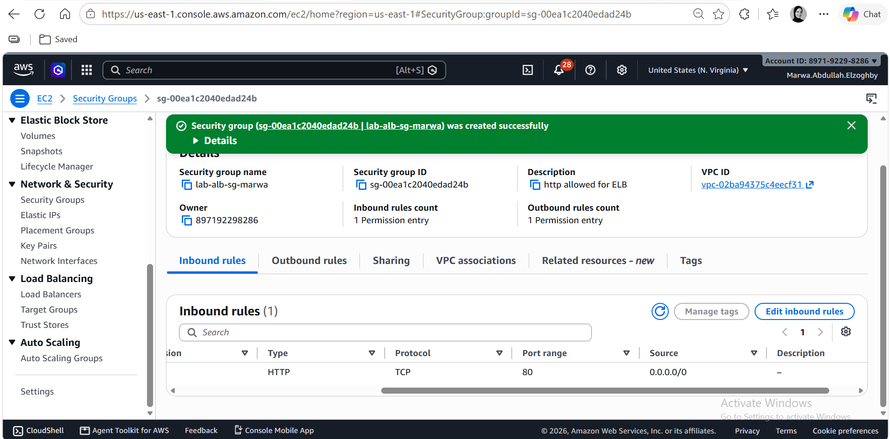
> 📸 **15:** the inbound rules of `lab-alb-sg`.

### 4.3 Target group and Application Load Balancer

- Target group `lab-tg`: HTTP:80, health check path `/`.
- Application Load Balancer `lab-alb`: internet-facing, two Availability Zones, listener HTTP:80 forwarding to `lab-tg`.

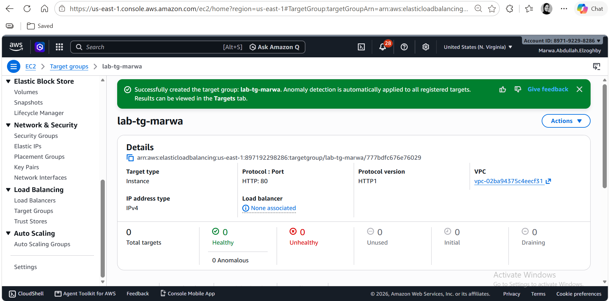
> 📸 **16:** the target group's **Health checks** settings.

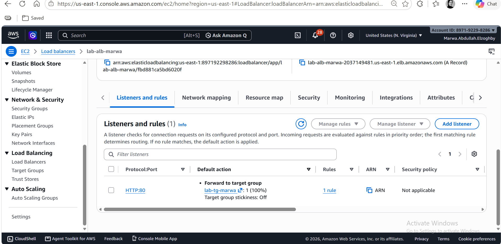
> 📸 **17:** the ALB **Details** tab (DNS name, two AZs, Active) and the listener forwarding to `lab-tg`.

### 4.4 Launch template and Auto Scaling Group

**Launch template** `lab-launch-template`: custom AMI `lab-app-ami`, t3.micro, security group `lab-web-sg`, the application instance profile, IMDSv2 required, and tag `Env=Dev` on instances.

**Auto Scaling Group** `lab-asg`: two Availability Zones, minimum 2, desired 2, maximum 4, attached to `lab-tg` with ELB health checks, `Env=Dev` tag propagated to launched instances, and a target tracking policy on **average CPU utilization** (target 50%).

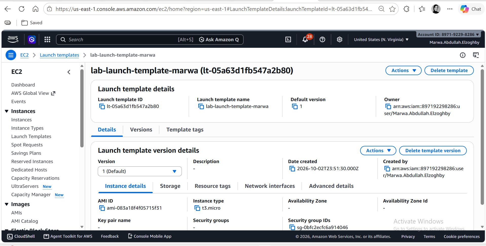
> 📸 **18:** the launch template details (AMI, instance profile, security group, Env=Dev tag).

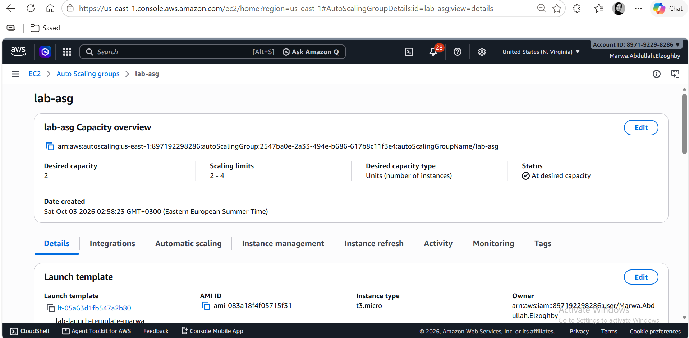
> 📸 **19:** the ASG **Details** tab showing capacity 2 / 2 / 4 and the two AZs.


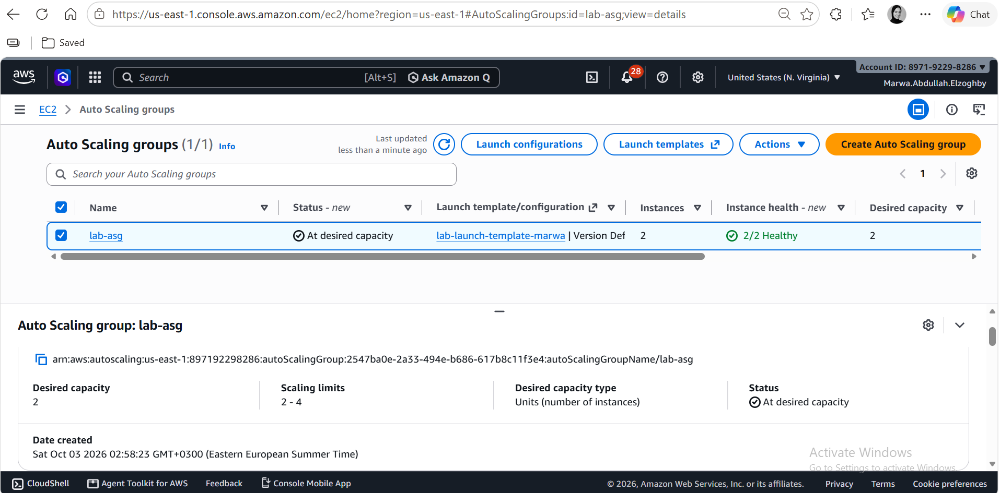
> 📸 **20:** the ASG **Activity** tab showing the two initial instance launches.

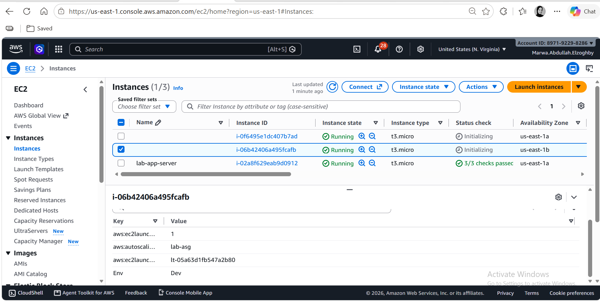
> 📸 **21:** the EC2 instance list with the ASG instances and the `Env=Dev` tag column.

### 4.5 Health and load balancing

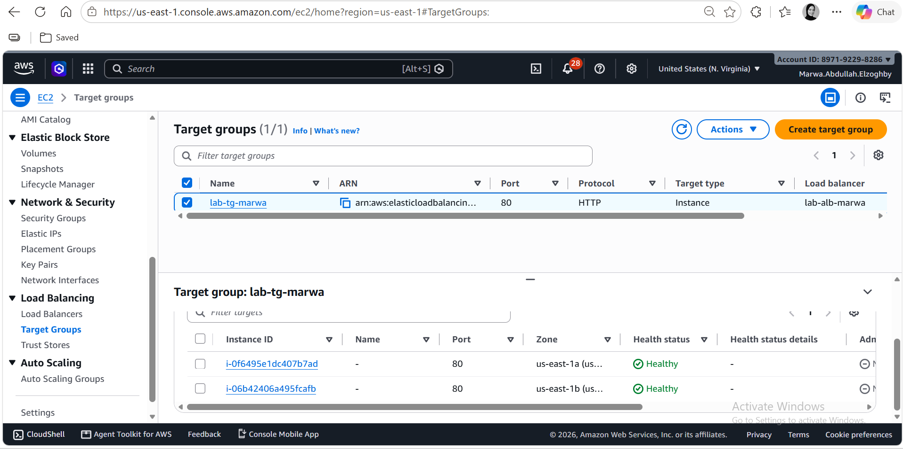
> 📸 **22:** the target group **Targets** tab showing both targets **healthy** in different AZs.

Opened the ALB DNS name and refreshed repeatedly. The hostname and instance ID changed between servers, showing that traffic is distributed.

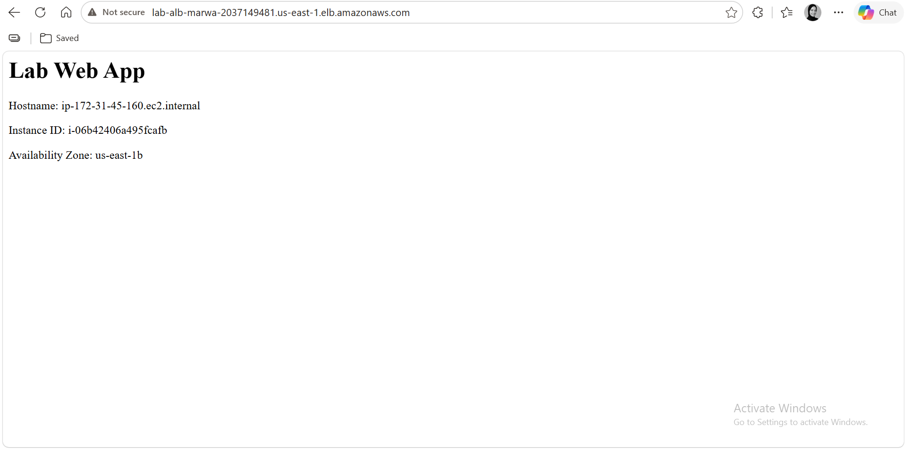
> 📸 **23:** the application page served by the first server.

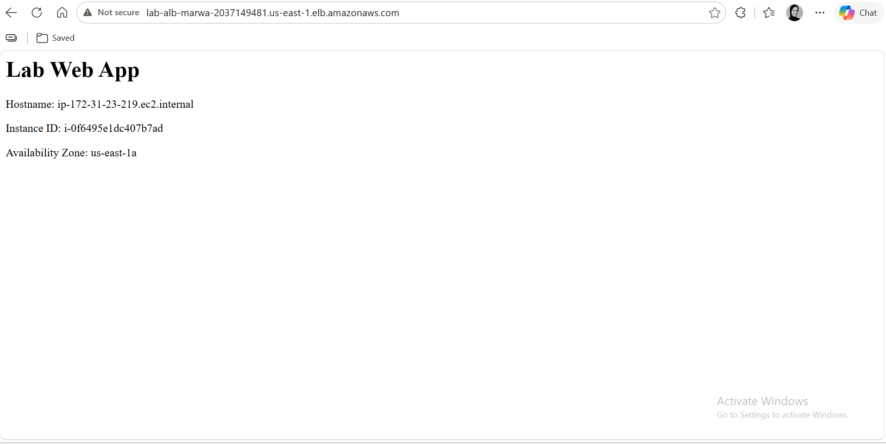
> 📸 **24:** the application page served by the second server (different hostname).


## 5. Cleanup: _[Completed]_

Resources were deleted in this order to avoid dependency errors and ongoing charges:

1. Auto Scaling Group `lab-asg` (this terminates its instances).
2. Application Load Balancer `lab-alb`, then target group `lab-tg`.
3. Launch template `lab-launch-template`.
4. Instance `lab-app-server` (and any other test instances).
5. Any remaining volumes (none were created for the EBS exercise).
6. AMI `lab-app-ami` (deregister first), then its snapshot.
7. S3 bucket `lab-app-bucket-897192298286` (empty it first, then delete).
8. Security groups: `lab-web-sg` first, then `lab-alb-sg`.


---


